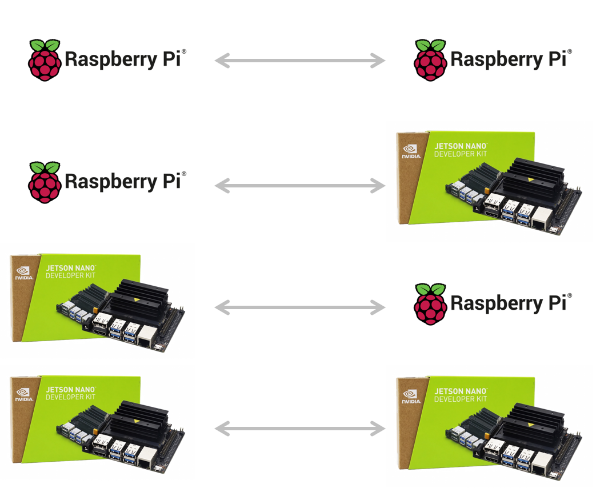

# 💻 한밭대학교 컴퓨터공학과 ColdBrew팀☕
 

### 🙏 팀 구성 및 역할 분탐

<table style="width: 100%; border-collapse: collapse; table-layout: fixed;">
    <tr align="center">
        <td style="padding: 0; border: 1px solid #ddd;">
            
        </td>
        <td style="padding: 0; border: 1px solid #ddd;">
            
        </td>
    </tr>
    <tr align="center">
        <td style="padding: 8px; border: 1px solid #ddd;">이원호</td>
        <td style="padding: 8px; border: 1px solid #ddd;">이승주</td>
    </tr>
    <tr align="center">
        <td style="padding: 8px; border: 1px solid #ddd;">20217144</td>
        <td style="padding: 8px; border: 1px solid #ddd;">20191745</td>
    </tr>
    <tr align="center">
        <td style="padding: 8px; border: 1px solid #ddd;">Experimental Analysis</td>
        <td style="padding: 8px; border: 1px solid #ddd;">Algorithm Development</td>
    </tr>
</table>

  
 

### 📊 Experimental Analysis

| 역할                 | 종류                                                                                                                                                                                                                                                |
| -------------------- | --------------------------------------------------------------------------------------------------------------------------------------------------------------------------------------------------------------------------------------------------- |
| Simulation           |                                                                                                                                           |
| Data                 |         |
| Programming Language |                                       |
| Device               |                                                                                                                                         |

 

### 📈  Algorithm Development                                                                                                                                                                                                                                                                                                                                                                                                                                                                                                                                                                                                                                                                                                                                                                                                                                                                                                      
| 역할                 | 종류                                                                                                                                                                                                                                                |
| -------------------- | --------------------------------------------------------------------------------------------------------------------------------------------------------------------------------------------------------------------------------------------------- |
| Simulation           |                                                                                                                                           |
| Data                 |        |
| Programming Language |                                       |
| Algorithm Development|    |

                                                                                                                                                                                                                         
                                                                                                          

## 1. 프로젝트 소개 및 필요성

    
    
    

이 프로젝트는 전시 상황에서 기지국이 파괴되어 드론이 임시 기지국 역할을 수행할 때, 제한된 비행 시간 내에서 최적의 통신 성능을 제공할 수 있는 비행 경로의 필요성을 증명하고 최적 경로를 분석합니다.

최근 드론 기술은 급격히 발달하여 통신, 수색, 구조 등의 다양한 분야에서 필수적인 도구로 자리 잡았습니다. 하지만 드론은 배터리 용량의 한계로 인해 비행 시간이 제한적이며, 특히 전시 상황에서는 빠른 배치와 효율적인 통신이 필수적입니다. 이러한 문제를 해결하기 위해 최적의 비행 경로를 찾는 것이 중요합니다.

8명의 사용자와 함께하는 환경에서 드론의 사각형, 원형, 호버링 비행 경로를 비교 평가하여, 각 경로에 따른 통신 성능을 연구하였습니다. 실험 결과를 통해 제한된 시간 내에서 최대 성능을 달성할 수 있는 방안을 제시하였습니다.

 

## 2. 기존 해결책의 문제

🪫배터리 수명과 운영 시간의 한계  
-드론은 비행 시간이 20여 분 내로 짧아 장시간 운용할 수 없습니다. 배터리 용량을 늘리면 본체 무게가 늘어나 결과적으로 소비 전력이 더 커지기 떄문에 아직까지 장거리 운행도 어렵습니니다.

📡 통신 범위 및 성능의 제한  
-드론은 고정 기지국과 달리 공중에 떠있기 때문에 통신 범위와 신호 강도가 고도 및 위치에 따라 달라질 수 있습니다. 특정 위치에서의 통신 성능이 저하되거나 지형적 장애물로 인해 신호가 차단될 수 있습니다. 전쟁 중 지리적 요인이 복잡할 경우, 통신 품질 유지가 어려울 수 있습니다

 

## 3. System Design
  - ### System Requirements
    - Rasberripy와 Jetson nano를 활용하여 소켓 통신 성능 비교
    - MATLAB을 이용하여 통신 성능 차이를 비교해보고 최적 경로의 필요성 증명
    - 왕복 비행 시간과 통신 시간의 반비례 관계를 밝혀내고 시뮬레이션을 통해 최적의 성능을 가지는 임계점 발견
    - 왕복 이동 간 장애물이 있을 시 최적의 경로를 구해내는 알고리즘 개발

### 1️⃣  - Rasberripy와 Jetson nano를 활용하여 서로 통신이 가능한지 여부를 확인하고 교차 실험

    

#### - 데이터 송수신 실험 결과 (N4동 614호, N4동 405-2호)

    

### 2️⃣  - 시뮬레이션을 이용하여 다양한 경로에서의 비행 경로 측정

    

### 3️⃣  - 1000번 시뮬레이션 case 결과물

    

#### - Average capacity result

    

#### - Aggregate capacity result

    

### 4️⃣ - Jain’s Fairness Index를 이용한 공정성 실험

    

#### - Jain’s Fairness Index result

    

### 5️⃣  - 왕복 이동 거리와 통신 시간의 반비례 관계 (최적의 통신 성능 임계점)

    

 

## 4. System Requirements

#### 1️⃣ 

#### 2️⃣ 

#### 3️⃣ 

#### 4️⃣

#### 5️⃣ 

 

## 5. Case Study

 

## 6. Description

 

## 7. Conclusion

